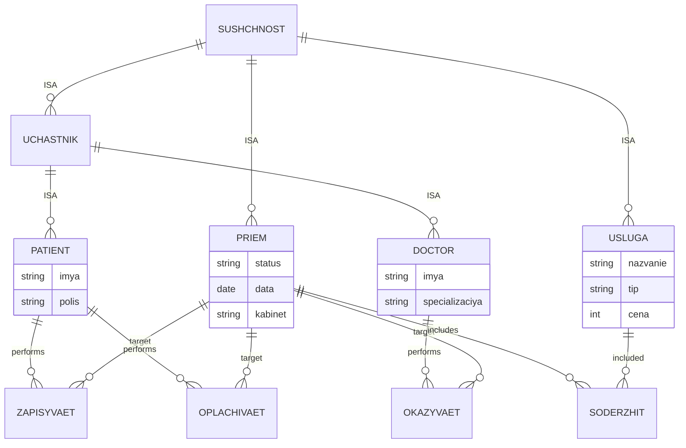

# ER-диаграмма: медицинская клиника (ЛР-1)

## Диаграмма сущностей и связей



## ISA-иерархия концептов

```
Сущность
├── Участник
│   ├── Пациент
│   └── Врач
├── Услуга
└── Приём
```

## ISA-иерархия связей (опционально, п.7)

```
ДействиеПациента
├── ЗАПИСЫВАЕТ
└── ОПЛАЧИВАЕТ

ДействиеВрача
└── ОКАЗЫВАЕТ

СОДЕРЖИТ (корневая связь)
```

## Легенда

| Обозначение | Смысл |
|-------------|--------|
| ISA | отношение «является подтипом» (наследование концептов) |
| performs / target | направление связи между экземплярами |
| includes / included | приём содержит услугу |
